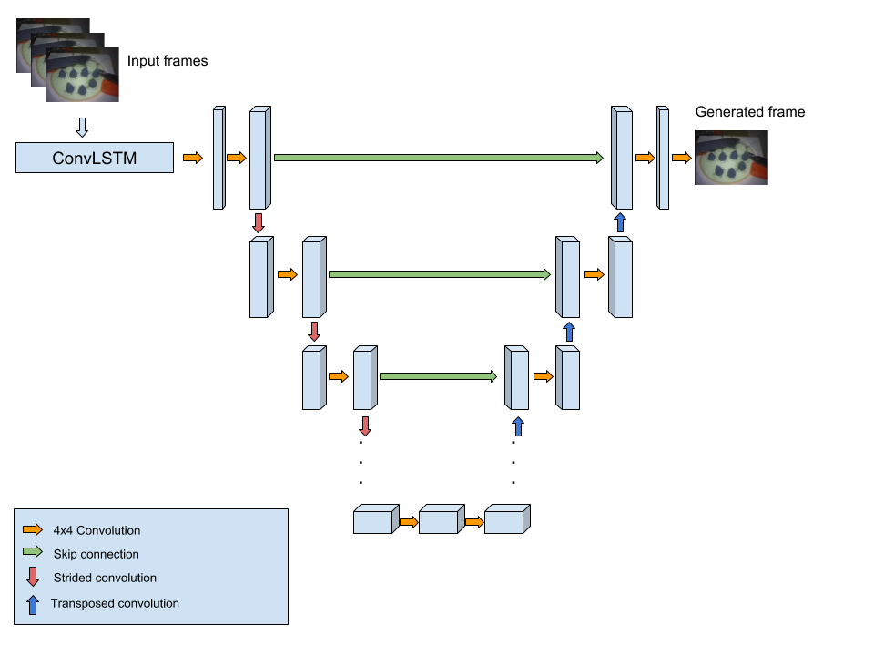
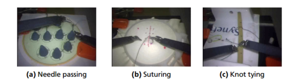

# Video Frame Prediction using Generative Adversarial Networks
This project extends Pix2Pix (Isola et al.) by introducing recurrent convolutional network (ConvLSTM) to predict next frame of a video given a sequence of previous frames as input. 

<a href="https://www.youtube.com/watch?feature=player_embedded&v=qYRys-0HEnk
" target="_blank"></a>
Click the image to play the video.

The model consists of two networks: Generator and Discriminator.
To learn from spatiotemporal nature of videos, the Generator uses ConvLSTM layer on top. The output features from this layer is passed to the remaining layers which are based on U-Net architecture. 

The Discriminator is a image classifier that classifies whether its input is an actual frame from the video or if it is generated by the Generator.
Dataset used: [JIGSAWS](https://cirl.lcsr.jhu.edu/research/hmm/datasets/jigsaws_release/), a surgical activity video dataset. You'll need to fill up a form @ https://cs.jhu.edu/~los/jigsaws/info.php to obtain the dataset. 


Any other dataset, or videos can also be used after some small modification in `data_utils.py`

## Requirements
Apart from the libraries provided by the Anaconda distribution, you'll need the following extra libraries before running the program.
```
keras==2.1.6
tensorflow-gpu==1.8.0
moviepy==0.2.3.5
```

## Code Overview
The network is implemented in `model.py`. It provides a class for GAN model based on Pix2Pix. The original idea of Pix2Pix has been extended with recurrent convolutional networks (ConvLSTM2D in keras) to learn from sequence of images. The model can be instantiated as follows:

`gan = Pix2Pix(im_height=im_height, im_width=im_width, lookback=timesteps-1)`

where `lookback` is the number of previous frames excluding the most latest one.

`train.py` assembles necessary data and initializes the model and trains it.

`evaluate.py` has two different functions to generate video from predictions and to evaluate different models.

`visualize.py` contains helper functions to visualize the saliency maps of the generator model.

`data_utils.py` contains helper functions to read video files from the disk and prepare them to feed the model. You'll have to modify `get_train_test_files` functions according to your needs since this was written specifically for loading JIGSAWS dataset.

